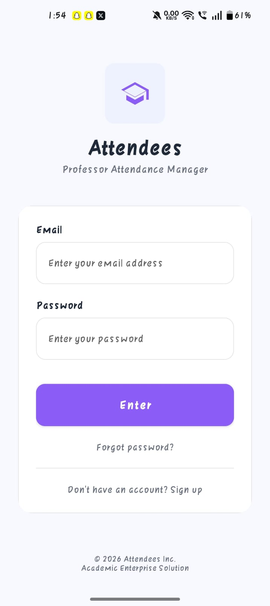
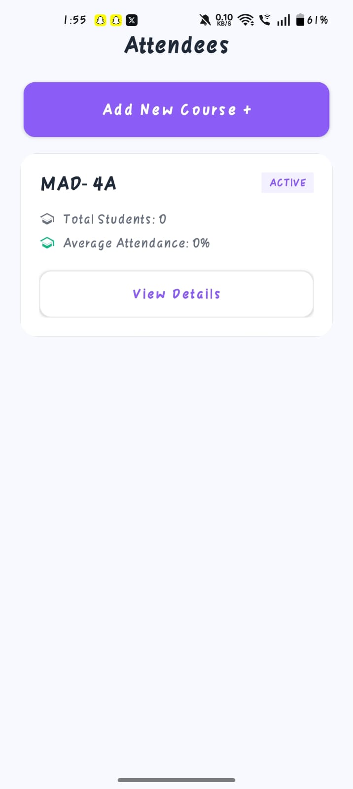
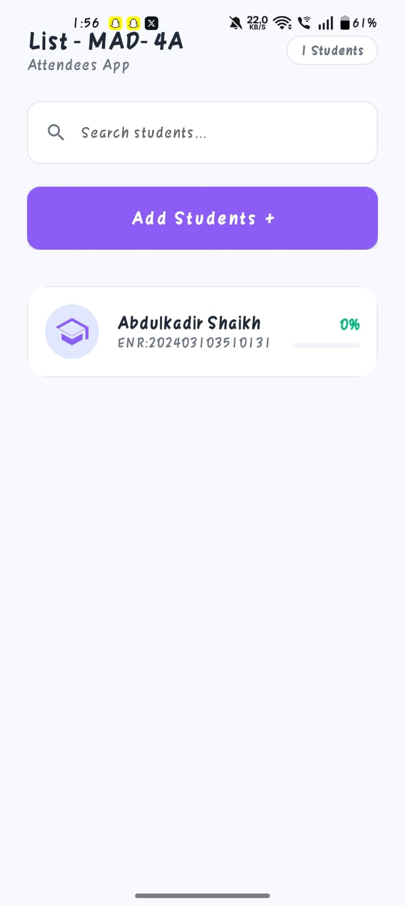
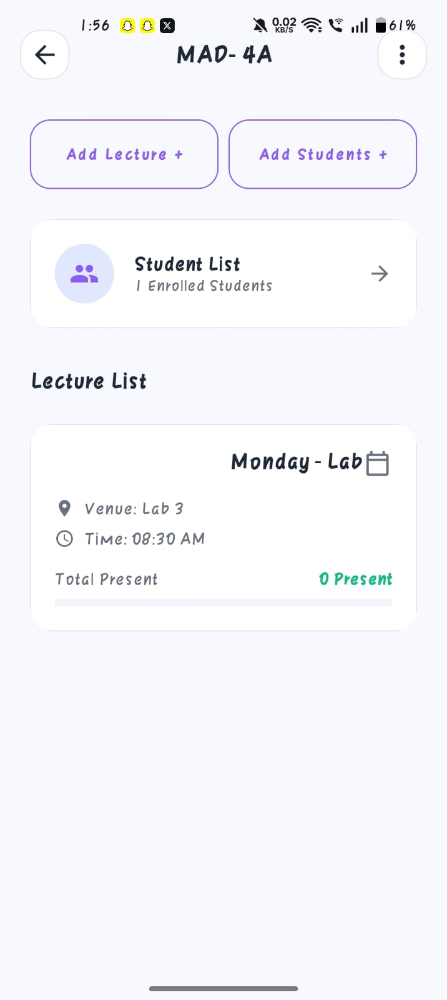
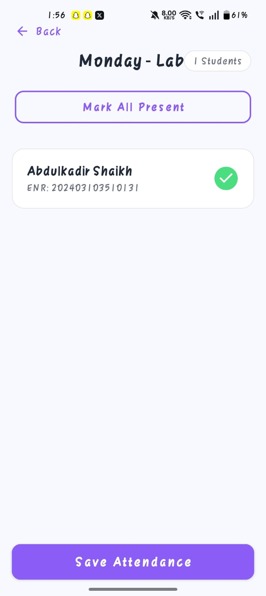

<p align="center">
  
</p>

# Attendees 📝

**Attendees** is a robust and intuitive Android application designed to streamline the process of managing course attendance. Built with a focus on usability and efficiency, it empowers educators to manage courses, track lectures, and keep accurate attendance records with ease.

---

## ✨ Features

- **🎓 Course Hub**: A centralized dashboard to manage all your courses. View course lists, add new courses, and access detailed course information.
- **📚 Lecture Management**: Add and organize lectures for specific courses. Track lecture dates, times, and topics.
- **✅ Attendance Marking**: Easily mark attendance for students during lectures. The app provides a clean interface for rapid data entry.
- **👤 Student Management**: Manage student rosters for each course. Add new students and view their attendance history.
- **📈 Dashboard Overview**: Get a high-level view of your teaching schedule and student engagement.

---

## 🛠️ Tech Stack

- **Language**: [Java](https://www.java.com/)
- **Platform**: [Android SDK](https://developer.android.com/sdk)
- **Database**: [SQLite](https://sqlite.org/) (Local storage)
- **UI Components**: RecyclerView, Material Design Components
- **Architecture**: MVC/MVVM pattern for clean separation of concerns.

---

## 📁 Project Structure

The project follows a standard Android modular package structure:

- `activities/`: UI controllers for different screens (Dashboard, Course Detail, etc.).
- `adapters/`: RecyclerView adapters for data display.
- `models/`: Data classes representing application entities (Course, Lecture, Student, Attendance).
- `database/`: Database helper and DAO classes for SQLite integration.
- `repository/`: Data management layer for abstraction between UI and Data Source.
- `utils/`: Helper classes for common tasks (Date formatting, String manipulation).

---

## 🚀 Getting Started

### Prerequisites

- [Android Studio](https://developer.android.com/studio) (Latest Version)
- Android API Level 24 or higher

### Installation

1. **Clone the repository**:
   ```bash
   git clone https://github.com/AbdulKadir-22/Attendees.git
   ```
2. **Open in Android Studio**:
   - Launch Android Studio.
   - Select **Open an Existing Project** and navigate to the project directory.
3. **Build the Project**:
   - Wait for Gradle to sync dependencies.
   - Click on **Build > Make Project**.
4. **Run the Application**:
   - Connect an Android device or start an emulator.
   - Click the **Run** button (Green Play icon).

---

## 📸 Screenshots

<p align="center">
  
  
  
</p>
<p align="center">
  
  
</p>

---

## 📜 License

This project is licensed under the MIT License - see the [LICENSE](LICENSE) file for details.
